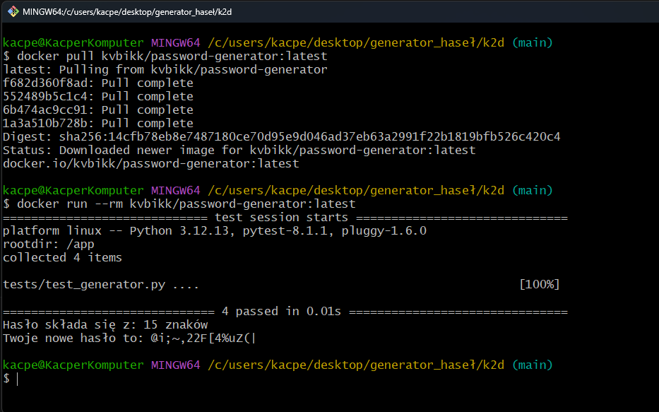

# Generator bezpiecznych haseł

# Badge: 

Aplikacja umożliwia generowanie losowych haseł o określonej długości i złożoności.

## Funkcje generatora:
- Regulacja długości hasła (parametr dlugosc_hasla)
- Możliwość włączenia i wyłączenia cyfr (parametr uzyj_cyfr)
- Możliwość włączenia i wyłączenia znaków specjalnych (parametr uzyj_specjalnych)

## Wymagania
Do poprawnego działania testów jest zainstalowana biblioteka pytest.

## Testowanie
Automatyczne testy jednostkowe + screenshoty testów

Komenda: 
```bash
py -m pytest
```


## Struktura folderów
- **src/generator.py:** Kod generatora Python.
- **tests/test_generator.py:** Skrypt testowy.
- **requiremenets.txt:** Lista zależności projektowych.
- **gitignore:** Ignorowanie niepotrzebnych plików na Github

  
## CI/CD, badge, Dockerfile (Checkpoint 2)

Projekt został w pełni zautomatyzowany i przeniesiony do środowiska Docker.

### Główne zmiany:
* **Docker:** Aplikacja posiada `Dockerfile`, który buduje izolowane środowisko z Pythonem 3.12
* **GitHub Actions:** Każdy `push` automatycznie uruchamia proces:
    1. **Linting** (flake8) - sprawdzanie czystości kodu.
    2. **Testy jednostkowe** (pytest) - weryfikacja logiki.
    3. **Docker* - budowanie obrazu i wysyłka na Docker Hub.
    4. **Testowe uruchomienie generatora** - pokazowe wygenerowanie hasła w logach GitHuba.

### Uruchomienie przez Docker:
Obraz znajduje się na Docker Hub. Aby go uruchomić:
```bash
docker run --rm kvbikk/password-generator:latest
```

