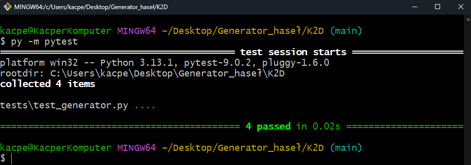

# Generator bezpiecznych haseł

# Badge:  

Aplikacja umożliwia generowanie losowych haseł o określonej długości i złożoności.

## Funkcje generatora:
- Regulacja długości hasła (parametr dlugosc_hasla)
- Możliwość włączenia i wyłączenia cyfr (parametr uzyj_cyfr)
- Możliwość włączenia i wyłączenia znaków specjalnych (parametr uzyj_specjalnych)

## Wymagania
Do poprawnego działania testów jest zainstalowana biblioteka pytest.

## Testowanie
Automatyczne testy jednostkowe + screenshoty testów

Komenda: 
```bash
py -m pytest
```


## Struktura folderów
- **src/generator.py:** Kod generatora Python.
- **tests/test_generator.py:** Skrypt testowy.
- **requiremenets.txt:** Lista zależności projektowych.
- **gitignore:** Ignorowanie niepotrzebnych plików na Github
